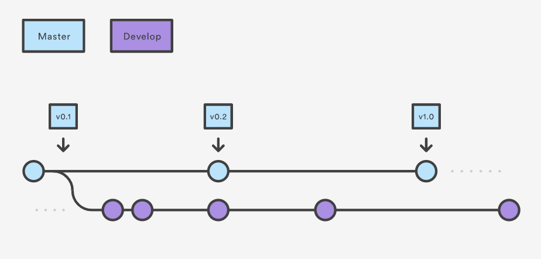
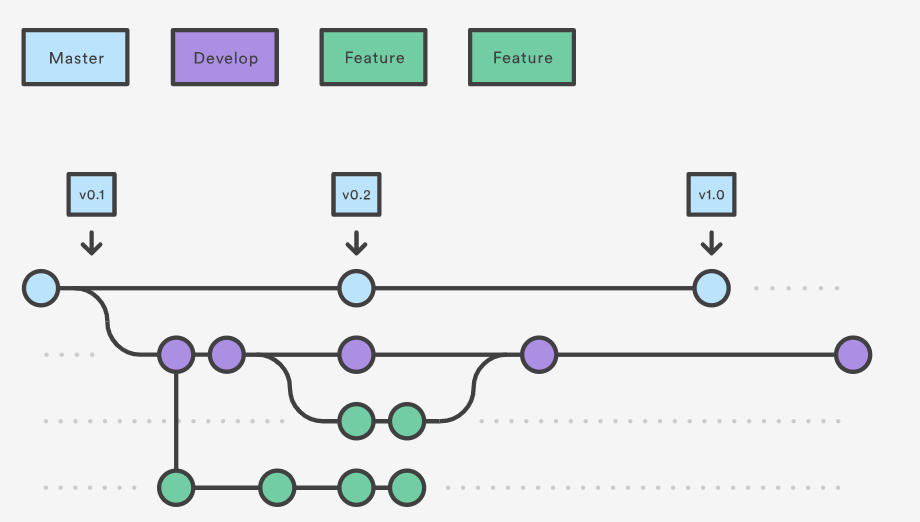
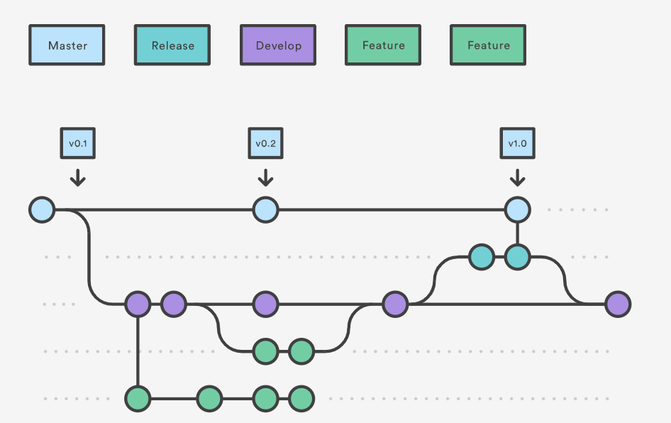
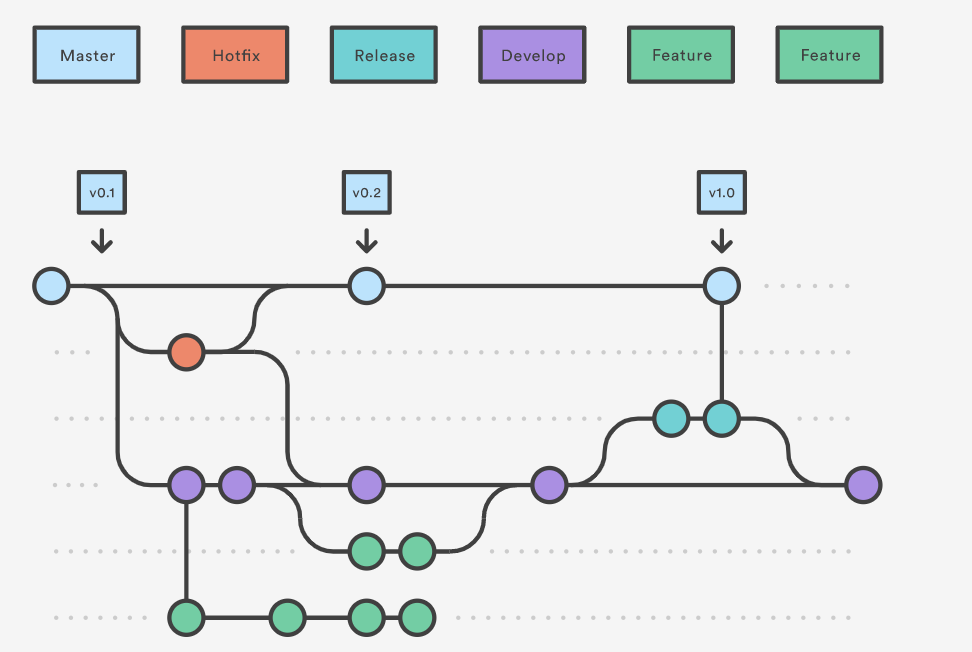

# Gitflow Workflow

## What is Gitflow?
Gitflow Workflow is a Git workflow that helps with continuous software development and implementing DevOps practices. It defines a strict branching model designed around the project release.

Gitflow is ideally suited for projects with a scheduled release cycle and for the DevOps best practice of coninuous delivery. This workflow assings very specific roles to different branches and defines how and when they should interact. In addition to feature branches, it uses indibidual branches for preparing, maintaining, and recording releases. 

## How it works?

### Develop and Master Branches
Instead of a single master branch, this workflow uses two branches to record the history of the project. 

__Master__: stores the official release history
__Develop__: serves as an integration barnch for features

### Feature Branches
Each new feature should reside in its own barnch, which can be pushed to the central repository for backup/collaboration. Instead of branching off of master, __feature branches use develop as their parent branch.__ __When a feature is complete, it gets merged back into develop.__ Features should never interact directly with master. 

### Release Branches 
Once develop has acquired enough features for a release, fork a release branch off of develop. Creating this branch starts the next release cycle, so no new features can be added after this point - only bug fixes, documentation generation, and other release-oriented tasks should go in this branch. Once its ready to ship, the release branch gets merged into master and tagged with a version number, and merged back into develop. 

### Hotfix Branches
Maintenance or 'hotfix' branches are used to quickly patch production releases. Hotfix branches are a lot like release branches and feature branches except they are based on master instead of develop. 

Reference:
https://www.atlassian.com/git/tutorials/comparing-workflows/gitflow-workflow#:~:text=Gitflow%20Workflow%20is%20a%20Git,designed%20around%20the%20project%20release.
